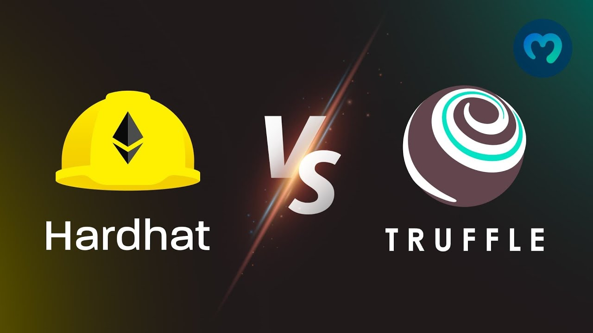

# Ganache + Hardhat Project

<p align="center">
  
</p>

This project demonstrates how to deploy Ethereum smart contracts to a local Ganache blockchain using **Hardhat**. It’s ideal for developers who want to build, test, and interact with smart contracts in a fast, secure, and repeatable local environment.

- **Hardhat** manages smart contract development, compilation, and deployment.
- **Ganache** provides a local Ethereum blockchain for testing.
- Includes: Sample Solidity contract, Hardhat config, deployment scripts, and step-by-step instructions.

---

##  Getting Started

### 1. Download Ganache

Download and install Ganache from the official archive:

 [Ganache Download](https://archive.trufflesuite.com/ganache/)

### 2. Install MetaMask

Install the MetaMask browser extension:

 [MetaMask Extension](https://chromewebstore.google.com/detail/metamask/nkbihfbeogaeaoehlefnkodbefgpgknn?utm_source=www.bing.com&pli=1)

---

##  Connect MetaMask to Ganache

1. **Start Ganache** and create a workspace (or use Quickstart).
2. Copy the RPC URL (usually `http://127.0.0.1:7545`).
3. In MetaMask:
   - Click the network selector > **Add Network**.
   - Choose **Custom Network**.
   - Fill in the details:
     - **Network Name**: Ganache
     - **RPC URL**: `http://127.0.0.1:7545`
     - **Chain ID**: `1337` (or as shown in Ganache)
     - **Currency Symbol**: ETH
   - Save the network.
4. **Import Ganache Account**:
   - Copy a private key from Ganache.
   - In MetaMask: *Import Account* > Paste the private key.

---

##  Initialize Hardhat

Make sure you have **Node.js** installed.

To set up Hardhat in your project:

```bash
npm install --save-dev hardhat
npx hardhat init
```

---

##  Deployment Script — `ignition/modules/Lock.js`

```js
const { buildModule } = require("@nomicfoundation/hardhat-ignition/modules");

module.exports = buildModule("StudentModule", (m) => {
  const studentContract = m.contract("Solidity", []);
  return { studentContract };
});
```

---

##  `hardhat.config.js`

```js
require("@nomicfoundation/hardhat-toolbox");

module.exports = {
  solidity: "0.8.8",
  networks: {
    localganache: {
      url: "http://127.0.0.1:7545", // ← replace with your Ganache RPC URL if different
      accounts: [
        "0x5ba4667eb5e3d"
      ],
    },
  },
};
```

---

##  Deploy Process

Run the deployment script using the following command:

```bash
npx hardhat run --network ganache ignition\modules\Lock.js
```
